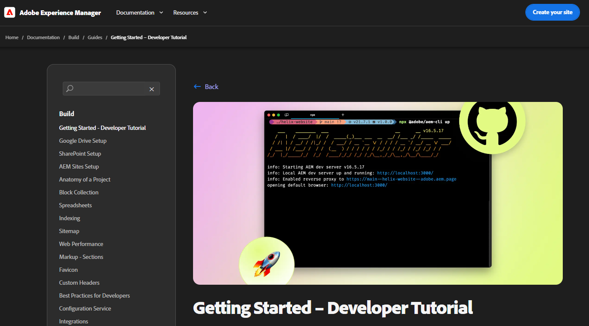

# Introdução

**Nota:** Você sempre pode seguir pela documentação oficial.

## O que é Adobe Edge Delivery Service

O Edge Delivery Service é uma estrutura moderna de entrega de conteúdo que recria como os sites são criados e entregues, otimizando a velocidade, a simplicidade e a escalabilidade. É uma parte essencial do Adobe Experience Manager e permite experiências digitais mais rápidas, aproximando a renderização e o delivery do usuário, na borda da rede ou seja o mais proximo possível do usuario final.

É importante ressaltar que não é uma substituição de uma CDN (Content Delivery Network), mas se integra perfeitamente à sua própria CDN.

## Pre-requesitos

O Adobe edge delivery é uma ferramenta que depende de alguns pre requisitos que ajudarão a compreender melhor a ferramenta.
 - Ter uma conta no [Github](https://github.com/?locale=pt-BR)
 - Ter conhecimentos sobre [HTML](https://developer.mozilla.org/pt-BR/docs/Web/HTML), [CSS](https://developer.mozilla.org/pt-BR/docs/Web/CSS) e [Javascript](https://developer.mozilla.org/en-US/docs/Web/JavaScript)
 - Ter uma versão do [Node/npm](https://nodejs.org/pt-br) instalada localmente
 - Ter configurado o [Github Code Sync](https://github.com/apps/aem-code-sync) no seu repositório, para isso acesse essa url: [https://github.com/apps/aem-code-sync/installations/new](https://github.com/apps/aem-code-sync/installations/new)

