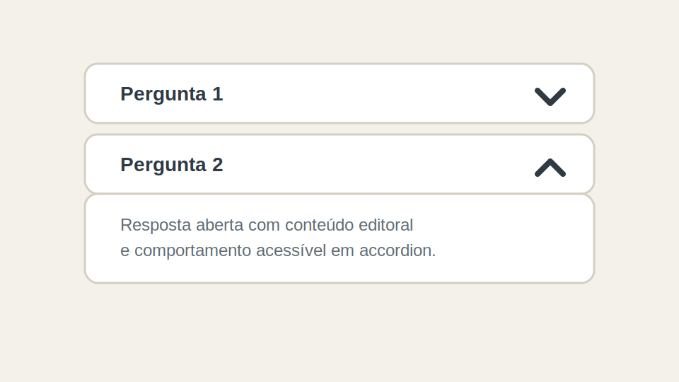

# Accordion

## Objetivo

Renderizar uma lista expansível de perguntas e respostas ou seções colapsáveis.

## Estrutura de autoria

O block espera linhas com duas colunas:

| Coluna 1 | Coluna 2 |
| --- | --- |
| título | conteúdo |

Ele também ignora uma linha de cabeçalho quando encontra `titulo` e `conteudo`.

## O que o JS faz

- lê todas as linhas do block;
- ignora cabeçalho;
- cria uma lista `.accordion-list`;
- transforma cada linha em:
  - `section.accordion-item`
  - `h3.accordion-heading`
  - `button.accordion-button`
  - `div.accordion-panel`
- aplica `aria-expanded`, `aria-controls` e `role="region"`;
- adiciona clique para abrir e fechar.

## Variações suportadas

- `.single`: mantém apenas um item aberto por vez.
- `.first-open`: abre o primeiro item ao carregar.

## Ilustração simples

```text
[ Pergunta 1 ] >
[ resposta oculta ]

[ Pergunta 2 ] v
[ resposta visível ]
```



## Observações de implementação

- O conteúdo da segunda célula é movido para dentro do painel.
- A acessibilidade é tratada diretamente no JS.
- O CSS controla o estado visual pelo modificador `.is-open`.
