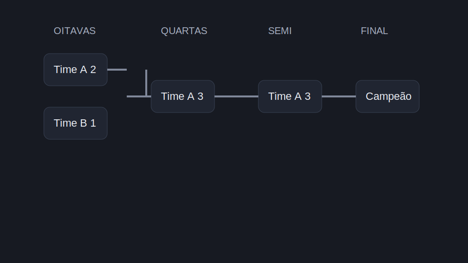

# Bracket

## Objetivo

Montar uma chave de campeonato a partir de dados inline ou de uma origem JSON.

## Modos de uso

### 1. Inline

O autor fornece as linhas diretamente no block.

Colunas esperadas:

| round | match | teamA | scoreA | teamB | scoreB | winner |
| --- | --- | --- | --- | --- | --- | --- |

### 2. Configurado por dados

O autor fornece pares `chave -> valor` em tabela.

Chaves suportadas:

- `source`
- `sheet`
- `split`
- `phase`
- `title`

## O que o JS faz

- detecta se o block é inline ou configurado;
- se houver `source`, faz `fetch` do JSON;
- normaliza as chaves dos dados;
- filtra por `split` e `phase`;
- agrupa por rodada;
- calcula alturas, offsets e conectores;
- gera cards de partida e destaque do vencedor.

## Estrutura visual criada

```text
Oitavas    Quartas    Semi    Final
[A 2]      [A 2]      [A 3]   [A 3]
[B 0] ---- [C 1] ---- [D 1] - [D 1]

[C 1]
[D 0]
```



## Pontos técnicos importantes

- O layout é calculado via CSS custom properties e offsets inline.
- Em mobile, o bracket troca de layout absoluto para fluxo vertical.
- O block aceita JSON em formatos diferentes desde que consiga achar um array válido.

## Quando usar

Use este block quando a estrutura de disputa é mais importante do que uma tabela tradicional.
