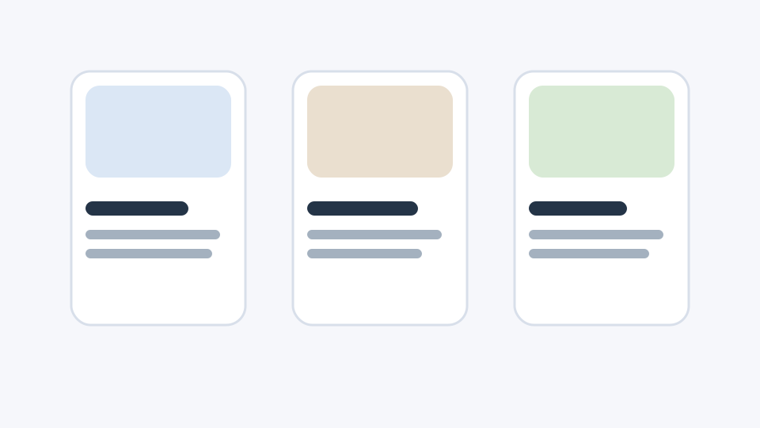

# Cards

## Objetivo

Transformar linhas autoradas em uma lista de cards com imagem e corpo.

## Estrutura de autoria

Cada linha do block vira um card. O JS assume:

- uma célula com `picture` vira imagem;
- as demais viram corpo do card.

## O que o JS faz

- cria um `ul`;
- transforma cada linha em `li`;
- move os filhos das células para dentro do card;
- marca áreas como:
  - `.cards-card-image`
  - `.cards-card-body`
- substitui imagens por `createOptimizedPicture(...)`.

## Ilustração simples

```text
+----------------------+
| imagem               |
| título               |
| descrição            |
+----------------------+
```



## Observações

- O block é simples e depende bastante do HTML autorado.
- A otimização de imagem é delegada ao helper do AEM.
