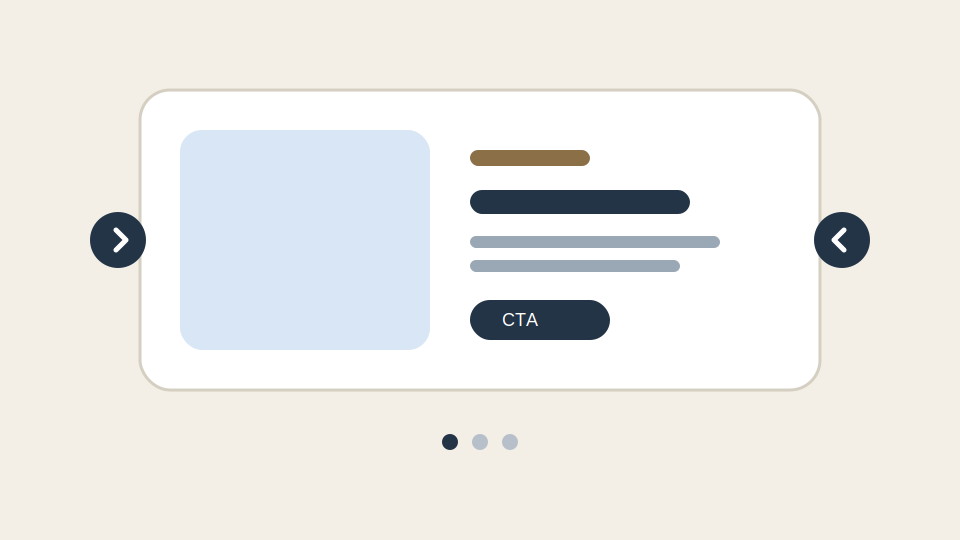

# Carousel

## Objetivo

Exibir uma sequência de slides com mídia, texto e CTA.

## Estrutura de autoria

O block espera cinco colunas por linha:

| imagem | eyebrow | título | descrição | link |
| --- | --- | --- | --- | --- |

Uma linha de cabeçalho com `imagem` é ignorada.

## O que o JS faz

- converte cada linha em um objeto de slide;
- cria viewport, track, arrows e dots;
- alterna o slide ativo com classes e atributos ARIA;
- suporta swipe em pointer events;
- suporta autoplay quando o block tem a classe `.autoplay`.

## Estrutura montada

```text
[<] [ slide ativo ] [>]
      o  o  o
```



## Recursos

- navegação por setas;
- navegação por dots;
- pausa do autoplay em hover e foco;
- swipe para mobile e touch.

## Observações

- O CTA é reaproveitado a partir do link autorado.
- O conteúdo rico da descrição é preservado com `innerHTML`.
