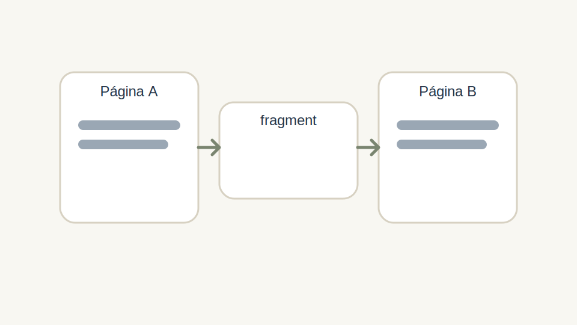

# Fragment

## Objetivo

Incluir conteúdo de outra página dentro da página atual.

## Forma de autoria

O block pode receber:

- um link para outra página;
- ou o caminho escrito como texto.

## O que o JS faz

- resolve o caminho;
- busca `${path}.plain.html`;
- cria um `main` temporário;
- corrige caminhos relativos de mídia;
- reaplica `decorateMain(...)`;
- carrega as sections do fragmento;
- injeta o conteúdo no block atual.

## Fluxo

```text
fragment
  |
  +-- fetch .plain.html
  +-- corrige mídia relativa
  +-- reaplica decoração
  +-- insere no DOM atual
```



## Quando usar

- repetir conteúdo compartilhado;
- compor páginas a partir de partes menores;
- reaproveitar seções mantidas em um único lugar.
