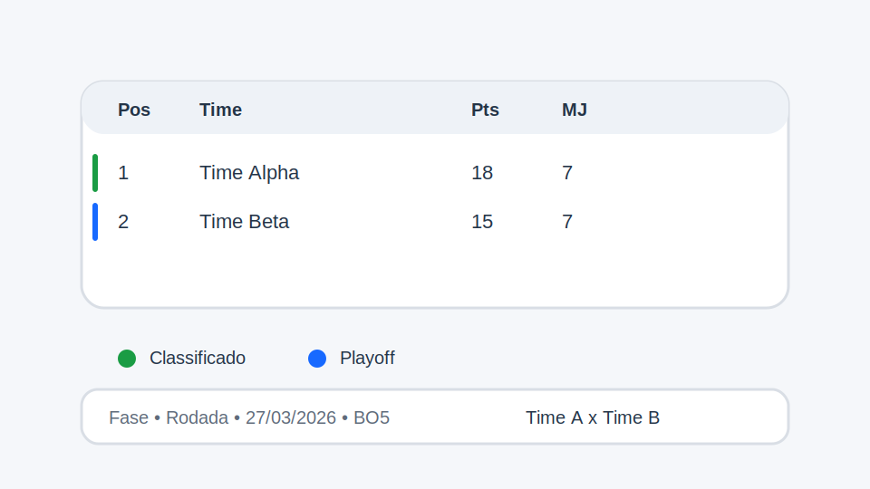

# Standings

## Objetivo

Renderizar classificação e, opcionalmente, uma lista de partidas a partir de tabela inline ou fontes JSON.

## Modos de uso

### 1. Inline

O autor fornece a tabela diretamente no block.

### 2. Configurado por dados

O block recebe uma tabela de configuração com chaves como:

- `source`
- `matches`
- `split`
- `phase`
- `limit`
- `title`
- `matches-title`

## O que o JS faz

- detecta se a entrada é inline ou configurada;
- busca JSON quando `source` e `matches` estão preenchidos;
- normaliza chaves;
- filtra por `split` e `phase`;
- ordena a classificação;
- cria tabela e legenda de status;
- renderiza partidas recentes ou futuras.

## Status suportados

- `classificado`
- `playoff`
- `repescagem`
- `rebaixamento`

Cada status gera:

- uma classe na linha;
- uma legenda visual abaixo da tabela.

## Conexão com `paths.json`

Este é o block que mais claramente conversa com endpoints de dados. Um caminho publicado como `/standings.json` pode ser usado como `source` ou `matches`.

## Ilustração simples

```text
Tabela de classificação
-----------------------
Pos | Time | Pts | ...

Legenda
  verde  classificado
  azul   playoff

Partidas
  fase • rodada • data • BO
  time A x time B
```



## Quando usar

Use este block quando a página precisa unir conteúdo editoral com dados estruturados de competição.
