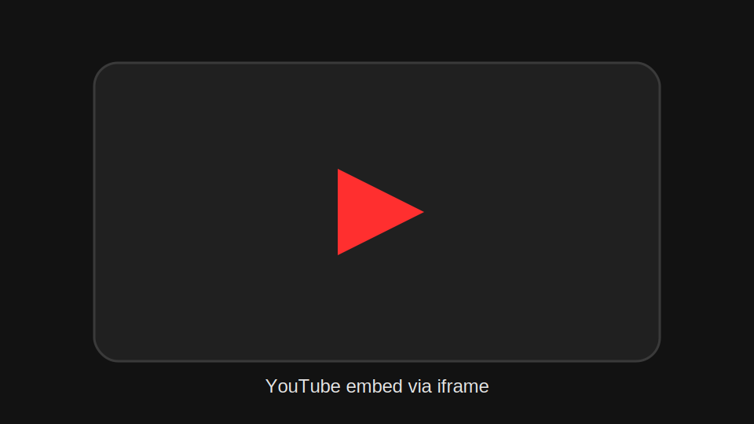

# Video

## Objetivo

Incorporar vídeo a partir de um link ou ID, hoje com suporte prático a YouTube.

## Entrada aceita

- URL `youtu.be/...`
- URL `youtube.com/watch?v=...`
- ID puro do vídeo

## O que o JS faz

- tenta identificar o provider e o ID;
- monta um `iframe` de embed;
- aplica atributos de segurança e performance;
- injeta tudo em `.video-embed`.

## Estrutura criada

```text
block
  -> div.video-embed[data-provider="youtube"]
       -> iframe
```



## Observações

- O parser hoje reconhece principalmente YouTube.
- O carregamento do iframe usa `loading="lazy"`.
